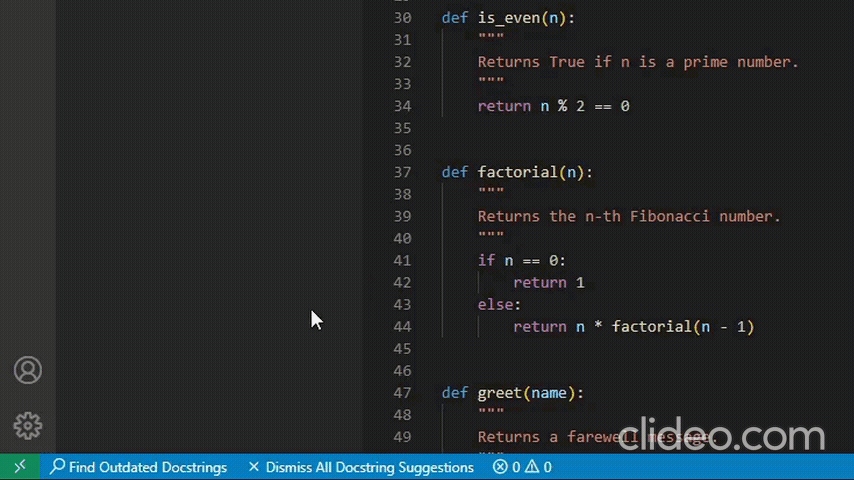
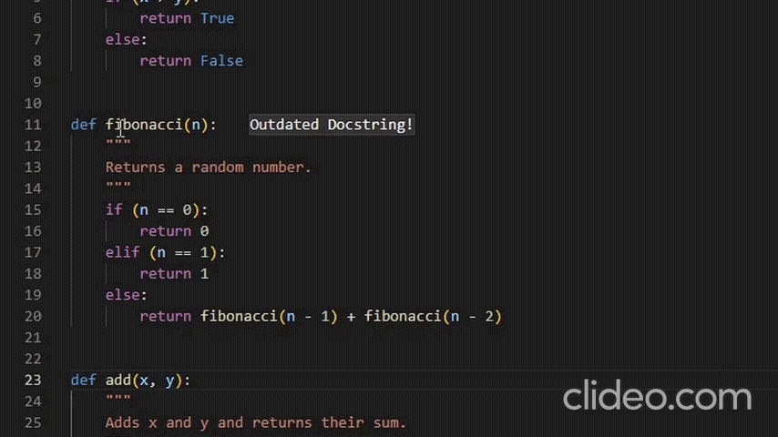

# LLaMaDoc

[](https://github.com/CR1337/LLaMaDoc/blob/master/LICENSE)

<p align="center">
  
</p>


# How To Use


Press "🔎 Find Outdated Docstrings" in the VSCode status bar.
<p>
   
</p>

Click the 💡 lightbulb in the line of the function definition to update the outdated docstring.
<p>
  
</p>


# Setup (Linux)

## Cloning and dependencies

- Clone the repository and change directory to the project folder.
```bash
git clone https://github.com/CR1337/LLaMaDoc.git
cd LLaMaDoc
```

- Create virtual environments
```bash
python3 -m venv llm-server/.venv
python3 -m venv github-scraper/.venv
```

- Install dependencies for `llm-server`
```bash
cd llm-server
source .venv/bin/activate
pip3 install -r requirements.txt
deactivate
cd .. 
```

- Install dependencies for `github-scraper`
```bash
cd github-scraper
source .venv/bin/activate
pip3 install -r requirements.txt
deactivate
cd ..
```

- Install dependencies for the LLaMaDoc Extension. The python dependencies have to be installed globally.
```bash
cd llamadoc
pip3 install -r requirements.txt
npm install
cd ..
```

## Recronstructing needed data/files

*If you are one of the lucky persons who got the zip file with all the required files you can just merge the content of the zip file with this repo. The directory structure is the same.*

### `github-scraper`

- Put your GitHub authentication token in `github-scraper/github-auth.token`:
```bash
echo "YOUR-TOKEN" > github-scraper/github-auth.token
```

- Run all scraping related scripts and notebooks. This will generate the intermediate files `github-sraper/data.pkl`, `github-scraper/train.pkl` and `github-scraper/test.pkl` as well as the files `github-scraper/train_data.json` and `github-scraper/test_data.json`. If you already have these files you can skip this step:
```bash
cd github-scraper
source .venv/bin/activate
python3 repo_metadata_scraper.py
python3 repo_scraper.py
# Run the notebook `scraping-analysis.ipynb`
deactivate
cd ..
```

### `finetuning`

- Copy the training data into the finetuning directory:
```bash
cp github-scraper/train_data.json finetuning/
```

- Run the finetuning notebook [`finetuning/finetuning.ipynb`](finetuning/finetuning.ipynb). This will generate the finetuning checkpoints in `finetuning/checkpoints/`.

### `llm-server`

- **IF** you want to run `llm-server` on a device without a GPU (not recommended) you have to create this file:
```bash
touch llm-server/not-on-server
``` 

- **IF** you don't have a huggingface token in your huggingface cache directory you have to create this file and put your token in it:
```bash
echo "YOUR-TOKEN" > llm-server/huggingface-token
```

- Copy the fintuned model adapter of your choice (e.g. number 9) into the right llm-server directory and rename it to `finetuned_0`:
```bash
cp -r finetuning/finetuning_checkpoints/checkpoint-ep9 llm-server/checkpoints/finetuned_0
```

- Copy the test data into the right llm-server directory:
```bash
cp github-scraper/test_data.json llm-server/evaluation/
```

## Launching the server

- Build the docker container:
```bash
cd llm-server
./build.sh
```

- **(A)** Either run the docker container in detached mode:
```bash
./run.sh
```

- **(B)** Or run the docker container in interactive mode:
```bash
./run-blocking.sh
```

- **(C)** Or **IF** you are on a machine without a GPU run:
```bash
./run-cpu.sh
```

In each script you can set a `GROUP` which determines the GPU the server will be using by computing `GROUP % 4`. The servers port will be set to `9000 + GROUP`.

## Launching the extension

Set the `address` field and the `port` field in [`llamadoc/llm_interface/server_config.json`](llamadoc/llm_interface/server_config.json) to the address and port of the `llm-server`:
```json
{
    "address": "http://ADDRESS",
    "port": PORT
}
```

You can now use the extension by running the VSCode [launch task](.vscode/launch.json) `Run Extension`. Just open a python file containing functions with docstrings in the newly opened VSCode window.

# Evaluation

There are two evaluations. One compares the quality of the generated docstrings between the original and the finetuned model: [`finetuning/evaluation/finetuning-evaluation.ipynb`](finetuning/evaluation/finetuning-evaluation.ipynb).

The other evaluation finds the best parameters for the out-of-date test and measures the performance of that test: [`llm-server/evaluation/out-of-date-evaluation.ipynb`](llm-server/evaluation/out-of-date-evaluation.ipynb).

## Finetuning Evaluation

- Copy the test data into the right directory:
```bash
cp github-scraper/test_data.json finetuning/evaluation/
```

- Run the evaluation notebook [`finetuning/evaluation/finetuning-evaluation.ipynb`](finetuning/evaluation/finetuning-evaluation.ipynb).

## Out-of-Date Evaluation

- Navigate to `http://ADDRESS:PORT/docs` in your browser and run the `/compute-predictions` endpoint once with `index = 0` and once with `index = 1`. This will generate the needed data for the evaluation: `llm-server/cache/updated_docstrings_0.json` and `llm-server/cache/updated_docstrings_1.json`.

- Run the notebook [`llm-server/evaluation/out-of-date-evaluation.ipynb`](llm-server/evaluation/out-of-date-evaluation.ipynb).
