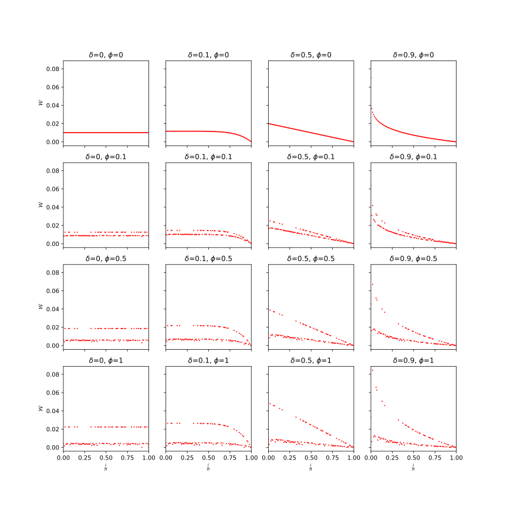
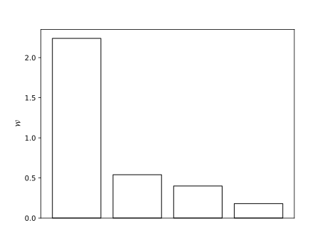

# Out of Date Tests

This document describes different methods how we can test if a docstring for a python function is out of date. We will describe the methods formally and explain them with an example.

## Definitions and Notation

We use lower case latin and greek letters for scalars (e.g. $n, \gamma$), bold latin letters for vectors (e.g. $\bf{t}, \bf{p}$), calligraphic capital letters for functions (e.g. $\mathcal{T}, \mathcal{D}$) and fraktur letters for strings (e.g. $\mathfrak{c}, \mathfrak{d}$). We also use the symbol $\circ$ for the concatenation of strings and vectors.

To denote the $i$-th element of a vector $\bf{v}$ we use the notation $\bf{v}[i]$ and to denote the vector conataining the $i$-th to $j$-th (exclusive) elements of a vector $\bf{v}$ we use the notation $\bf{v}[i:j]$.

Also let $\Sigma^*$ denote the set of all Unicode strings and $\Sigma^k$ denote the set of all strings of length $k$.

## Inputs

The inputs are the code of a python function $\mathfrak{c} \in \Sigma^*$ and the docstring $\mathfrak{d_u} \in \Sigma^*$ the user provided for the function.

#### Example

For our example we let $\mathfrak{c}$ be the following code:

```python
def double(x):
    return x * 2
```

and $\mathfrak{d_u}$ be the following docstring:

```
Triples the value x
```

## Output

The output is $q \in \{\text{true},\text{false}\}$ indicating if the docstring is out of date.

#### Example

For our example the output would be $q=\text{true}$ because the docstring is out of date.

## A Prediction based testing


In this section we describe how the evaluation function $\mathcal{E_P}: \Sigma^* \times \Sigma^*\to\{\text{true},\text{false}\}$ determines if a docstring is out of date using a prediction based method.

### 1. Tokenization

Let $\mathcal{T}:\Sigma^*\to\mathbb{N}^*$ be the tokenizer function that maps a string to a vector of token ids and $\mathcal{T}^{-1}:\mathbb{N}^*\to\Sigma^*$ be the inverse function that maps a vector of token ids to a string.

We first map the code $\mathfrak{c}$ and the user provided docstring $\mathfrak{d_u}$ to token ids $\bf{t_c} \in \mathbb{N}^o$ and $\bf{t_{d_u}} \in \mathbb{N}^n$ respectively:

$\bf{t_c} = \mathcal{T}(\mathfrak{c})$

$\bf{t_{d_u}} = \mathcal{T}(\mathfrak{d_u})$

with $o \in \mathbb{N}$ and $n \in \mathbb{N}$ being the number of tokens in $c$ and $d_u$ respectively.

#### Example

Consider the following (drastically simplified) vocabulary of the tokenizer:

| Token | ID |
|:-----:|:--:|
| def   | 0  |
| double| 1  |
| (     | 2  |
| x     | 3  |
| )     | 4  |
| :     | 5  |
| return| 6  |
| *     | 7  |
| 2     | 8  |
| Triples| 9  |
| the   | 10 |
| value | 11 |
| Doubles| 12 |
| \<code>| 13 |
| \<docstring>| 14 |
| \<eos>| 15 |

We ignore whitespaces and assume that one word or symbol corresponds to one token. In reality the tokenizer would probably tokenize the code and docstring into different tokens.

The tokenization of the code $\mathfrak{c}$ and the docstring $\mathfrak{d_u}$ would be:

$\bf{t_c} = (0, 1, 2, 3, 4, 5, 6, 3, 7, 8)$

$\bf{t_{d_u}} = (9, 10, 11, 3)$

### 2. Prediction

Next we construct the prompt $\mathfrak{p}=$ "\<code>" $\circ \mathfrak~{c}~\circ$ "\<docstring>" and its token vector $\bf{t_p} = \mathcal{T}(\mathfrak{p})$.

Let $M_G$ be the generative model that was finetuned to generate docstrings for python functions. Let further $\mathcal{G}_{M_G}:\mathbb{N}^*\to\mathbb{N}^*$ be the function that generates the next tokens for a given token vector using the model $M_G$ until an end-of-sequence token ("\<eos>") is generated.

We let $\bf{t_{d_m}}$ be the token vector for the docstring generated by the model $M_G$ for the code prompt $\mathfrak{p}$:

$\bf{t_{d_m}} = \mathcal{G}_{M_G}(\bf{t_p})$

#### Example

For our example we would construct the prompt $\mathfrak{p}$ as follows:

```
<code>def double(x): return x * 2<docstring>
```

and let the model generate the following docstring:

```
Doubles the value x
```

The tokenization of the model generated docstring then is:

$\bf{t_{d_m}} = (12, 10, 11, 3)$


### 3. Logit and probability computation

Let $\mathcal{L}_{M_G}:\mathbb{N}^*\to\mathbb{R}^*$ be the function that computes the [logits](https://en.wikipedia.org/wiki/Logit) for the next token generated by the model $M_G$ for given prompt tokens $\bf{t}\in\mathbb{N}^*$. By using the [$\text{softmax}$](https://en.wikipedia.org/wiki/Softmax_function) function we obtain the probability distribution $\bf{f}(\bf{t})$ for the next token over the vocabulary:

$\bf{f}(\bf{t}) = \text{softmax}(\mathcal{L}_{M_G}(\bf{t}))$

We construct a series of prompt token vectors $\bf{t_i^u}$ by concatenating the code and the first $i$ tokens of the user provided docstring:

$\forall i \in \{0,1,\ldots,n\}: \bf{t_i^u} = \bf{t_p} \circ \bf{t_{d_u}}[0:i]$

and a series of prompt token vectors $\bf{t_i^m}$ by concatenating the code and the first $i$ tokens of the model generated docstring:

$\forall i \in \{0,1,\ldots,m\}: \bf{t_i^m} = \bf{t_p} \circ \bf{t_{d_m}}[0:i]$

We compute the probability distributions $\bf{f_i^u}$ and $\bf{f_i^m}$ for the next token for each prompt $\bf{t_i^u}$ and $\bf{t_i^m}$:

$\forall i \in \{0,1,\ldots,n\}: \bf{f_i^u} = \text{softmax}(L_{M_G}(\bf{t_i^u}))$

$\forall i \in \{0,1,\ldots,m\}: \bf{f_i^m} = \text{softmax}(L_{M_G}(\bf{t_i^m}))$

Next we we obtain the probabilities $p_i^u$ and $p_i^m$ for each token $\bf{t_{d_u}}[i+1]$ and $\bf{t_{d_m}}[i+1]$ by looking them up in the probability distributions $\bf{f_i^u}$ and $\bf{f_i^m}$:

$\forall i \in \{0,1,\ldots,n-1\}: p_i^u = \bf{f_i^u}[\bf{t_{d_u}}[i+1]]$

$\forall i \in \{0,1,\ldots,m-1\}: p_i^m = \bf{f_i^m}[\bf{t_{d_m}}[i+1]]$

Resulting in the probability vectors $\bf{p_u}$ and $\bf{p_m}$:

$\bf{p_u} = (p_0^u, p_1^u, \ldots, p_{n-1}^u)$

$\bf{p_m} = (p_0^m, p_1^m, \ldots, p_{m-1}^m)$


#### Example

For our example we would construct the following prompt token vectors (shown as strings for better readability):

The prompts $\bf{t_i^u}$ would be:
```
<code>def double(x): return x * 2<docstring>
<code>def double(x): return x * 2<docstring>Triples
<code>def double(x): return x * 2<docstring>Triples the
<code>def double(x): return x * 2<docstring>Triples the value
```

And the prompts $\bf{t_i^m}$ would be:
```
<code>def double(x): return x * 2<docstring>
<code>def double(x): return x * 2<docstring>Doubles
<code>def double(x): return x * 2<docstring>Doubles the
<code>def double(x): return x * 2<docstring>Doubles the value
```

To keep our sanity we will not show the logits or probability distributions for each prompt and skip directly to the probabilities for the next tokens that could be generated by the model:

$\bf{p_u} = (0.1, 0.2, 0.5, 0.6)$

$\bf{p_m} = (0.9, 0.2, 0.5, 0.6)$

These probabilities are not the real token probabilites but the conditional probabilities for the next token given the previous tokens and therefore as good of a measure as we can practically get from the model.

### 4. Certainty measure

Now we can define a measure how "sure" the model is about the tokens in $\mathfrak{d_u}$ and $\mathfrak{d_m}$. Intuitively the measure should be high if the model is likely to generate the given tokens and low if the model is unlikely to generate the given tokens. Because the model was finetuned to generate up-to-date docstrings we expect the measure to be high for up-to-date docstrings and low for out-of-date docstrings.

Because tokens are dependent on the previous tokens we have to take this into account. The later tokens are more and more correlated with the docstring and less with the code. Therefore it is preferable to assign a lower weight to the later docstring tokens.

Another goal is to assign higher weights to tokens that are less frequent in the finetuning data similar to the [TF-IDF](https://en.wikipedia.org/wiki/Tf%E2%80%93idf) weighting scheme. We use the inverse relative log token frequency $\mathcal{F}_i$ that is defined as follows:

$\displaystyle{\mathcal{F}(i) = \max_{k=0}^{n-1}\left\{\ln f_k\right\}\cdot\left(\ln f_i\right)^{-1}}$

where $f_i$ is the absolute frequency of the token $i$ in the finetuning data.

To achieve both goals we define a weight function $\mathcal{W}^*:\mathbb{N}^2\to\mathbb{R}$ that assigns a weight to each probability in the list:

$\displaystyle{\mathcal{W}^*(i, n) = \left(1 - \left(\frac{i}{n}\right)^\gamma\right)\cdot \left(\phi\mathcal{F}(i)+(1-\phi)\right)}$

with $i$ being the index of the probability and $n$ being the number of probabilities (so $i < n$). $\gamma$ is the decay exponent and controls how fast the weights decay. $\phi$ is the frequency importance and controls how much the frequency of the tokens is taken into account. $\gamma$ takes values in the interval $[0,\infty)$ and is mapped to the interval $(0,1)$ using the tangent function for convenience:

$\displaystyle{\gamma = \tan\left(\frac{\pi}{2}\left(1-\delta\right)\right)}$

with $\delta \in (0,1)$ being the weight decay parameter. To also allow the values $0$ and $1$ for $\delta$ in practice we clamp any value to the interval $[\varepsilon, 1-\varepsilon]$ with $\varepsilon > 0$ being a very small value but not that small that it would cause floating point rounding to $[0, 1]$.

To make sure that the weights sum up to $1$ we define the normalized weight function $\mathcal{W}:\mathbb{N}^2\to\mathbb{R}$ as follows:

$\displaystyle{\mathcal{W}(i, n) = \frac{\mathcal{W}^*(i, n)}{\sum\limits_{k=0}^{n-1} \mathcal{W}^*(k, n)}}$

The following plot shows the weight function for different values of $\delta$ and $\phi$ and random [zipfian distributed](https://en.wikipedia.org/wiki/Zipf%27s_law) token frequencies:



Lastly we define the measurement function $\mathcal{M}:\mathbb{R}^n\to\mathbb{R}$ as the weighted geometric mean of the token probabilities:

$\displaystyle{\mathcal{M}(\bf{p}) = \exp\left(\sum_{i=0}^{n-1} \mathcal{W}(i, n)\cdot ln~p_i\right)}$

#### Example

Let us assume the following token frequencies for the finetuning data:

|Token ID $i$ | Token | Absolute Frequency | log Frequency | relative log Frequency | $\mathcal{F}(i)$ | 
|:-:|:-----:|:---------:|:---------:|:---------:|:---------:|
|0|def|	1000|	6.91|	0.86|	1.16|
|1|double|	100|	4.61|	0.58|	1.74|
|2|(|	1000|	6.91|	0.86|	1.16|
|3|x|	100|	4.61|	0.58|	1.74|
|4|)|	1000|	6.91|	0.86|	1.16|
|5|:|	1000|	6.91|	0.86|	1.16|
|6|return|	2000|	7.60|	0.95|	1.05|
|7|*|	3000|	8.01|	1.00|	1.00|
|8|2|	100|	4.61|	0.58|	1.74|
|9|Triples|	10|	2.30|	0.29|	3.48|
|10|the|	1000|	6.91|	0.86|	1.16|
|11|value|	100|	4.61|	0.58|	1.74|
|12|Doubles|	10|	2.30|	0.29|	3.48|
|13|\<code>|	1000|	6.91|	0.86|	1.16|
|14|\<docstring>|	1000|	6.91|	0.86|	1.16|
|15|\<eos>|	1000|	6.91|	0.86|	1.16|

We choose $\gamma = 0.5$ and $\phi = 0.5$. The weights $w^*_{p_i^u}$ and $w^*_{p_i^m}$ would then be:

$\displaystyle{w^*_{p_1^u} = w^*_{p_1^m} = \left(1-\left(\frac{0}{n}\right)^{0.5}\right)\cdot (0.5\cdot 3.48+(1-0.5)) = 2.24}$

$\displaystyle{w^*_{p_2^u} = w^*_{p_2^m} = \left(1-\left(\frac{1}{n}\right)^{0.5}\right)\cdot (0.5\cdot 1.16+(1-0.5)) = 0.54}$

$\displaystyle{w^*_{p_3^u} = w^*_{p_3^m} = \left(1-\left(\frac{2}{n}\right)^{0.5}\right)\cdot (0.5\cdot 1.74+(1-0.5)) = 0.40}$

$\displaystyle{w^*_{p_4^u} = w^*_{p_4^m} = \left(1-\left(\frac{3}{n}\right)^{0.5}\right)\cdot (0.5\cdot 1.74+(1-0.5)) = 0.18}$

After normalization we get the weights $w_{p_i^u}$ and $w_{p_i^m}$:

$w_{p_1^u} = w_{p_1^m} = 0.67$

$w_{p_2^u} = w_{p_2^m} = 0.16$

$w_{p_3^u} = w_{p_3^m} = 0.12$

$w_{p_4^u} = w_{p_4^m} = 0.05$

We can already see that the first word is probably more important than the other words:



Lastly we compute the measures $\mathcal{M}(\bf{p_u})$ and $\mathcal{M}(\bf{p_m})$ for the user provided docstring and the model generated docstring:

$\displaystyle{\mathcal{M}(\bf{p_u}) = \exp\left(0.67\cdot\ln 0.1 + 0.16\cdot\ln 0.2 + 0.12\cdot\ln 0.5 + 0.05\cdot\ln 0.6\right) = 0.14}$

$\displaystyle{\mathcal{M}(\bf{p_m}) = \exp\left(0.67\cdot\ln 0.9 + 0.16\cdot\ln 0.2 + 0.12\cdot\ln 0.5 + 0.05\cdot\ln 0.6\right) = 0.65}$

### 5. Evaluation

We can now define the evaluation function $\mathcal{E_P}: \Sigma^* \times \Sigma^*\to\{\text{true},\text{false}\}$ as follows:

$\displaystyle{\mathcal{E_P}(\mathfrak{c}, \mathfrak{d_u}) = \frac{\mathcal{M}(\bf{p_u})}{\mathcal{M}(\bf{p_m})} \leq \theta}$

with $\theta \in \mathbb{R^+}$ being the threshold. If the ratio of the measures is smaller than the threshold the docstring is considered out of date.
##### Example

For our example we could choose $\theta = 1$. The test would then return $\text{true}$ because $\frac{0.14}{0.65} \leq 1$. The docstring is considered out of date.

## B Distance based testing

In this section we describe how the evaluation function $\mathcal{E_D}: \Sigma^* \times \Sigma^*\to\{\text{true},\text{false}\}$ determines if a docstring is out of date using the distance between embeddings of the code and the docstrings.

### 1. Prediction

Similar to previous method we first generate the docstring $\mathfrak{d_m}$ for the code $\mathfrak{c}$ using the model $M_G$:

$\mathfrak{d_m} = \mathcal{T}^{-1}(\mathcal{G}_{M_G}(\mathfrak{p}))$

### 2. Embeddings

Let $\mathcal{P}_{M_E}:\mathbb{\Sigma^*}\to\mathbb{R}^d$ be the embedding function that projects a string to a $d$-dimensional vector using the embedding model $M_E$.

We map the code $\mathfrak{c}$, the user provided docstring $\mathfrak{d_u}$ and the model generated docstring $\mathfrak{d_m}$ to their embeddings:

$\bf{e_c} = \mathcal{P}_{M_E}(\mathfrak{c})$

$\bf{e_{d_u}} = \mathcal{P}_{M_E}(\mathfrak{d_u})$

$\bf{e_{d_m}} = \mathcal{P}_{M_E}(\mathfrak{d_m})$

#### Example

For our example we assume that $d=3$ and that the embeddings are the following:

$\bf{e_c} = (0.1, 0.2, 0.3)$

$\bf{e_{d_u}} = (0.2, 0.8, 0.4)$

$\bf{e_{d_m}} = (0.1, 0.3, 0.5)$

### 3. Distance measure

We define the distance measure $\mathcal{D}:\mathbb{R}^d\times\mathbb{R}^d\to\mathbb{R}$. That can be any distance measure like the [cosine similarity](https://en.wikipedia.org/wiki/Cosine_similarity) or the [Euclidean distance](https://en.wikipedia.org/wiki/Euclidean_distance).

We compute the distances $d_{\mathfrak{d_u}}$ and $d_{\mathfrak{d_m}}$ between the code and the user provided docstring and the code and the model generated docstring:

$d_{\mathfrak{d_u}} = \mathcal{D}(\bf{e_c}, \bf{e_{d_u}})$

$d_{\mathfrak{d_m}} = \mathcal{D}(\bf{e_c}, \bf{e_{d_m}})$

#### Example

For our example we would choose the euclidean distance as the distance measure. The distances would then be:

$d_{\mathfrak{d_u}} = 0.22$

$d_{\mathfrak{d_m}} = 0.62$

### 4. Testing

We can now define the evaluation function $\mathcal{E_D}: \Sigma^* \times \Sigma^*\to\{\text{true},\text{false}\}$ as follows:

$\displaystyle{\mathcal{E_D}(\mathfrak{c}, \mathfrak{d_u}) = \frac{d_{\mathfrak{d_u}}}{d_{\mathfrak{d_m}}} \leq \theta}$

with $\theta \in \mathbb{R^+}$ being a threshold. If the ratio of the distances is smaller than the threshold the docstring is considered out of date.

#### Example

For our example we could choose $\theta = 1$. The test would then return $\text{true}$ because $\frac{0.22}{0.62} \leq 1$. The docstring is considered out of date.

## Choice of method and parameters

The best method and parameters $\delta$, $\phi$, $\mathcal{D}$ and $\theta$ have to be chosen empirically. Using the $F_1$-score on a validation set is a possible way to determine the optimal values for these parameters.
