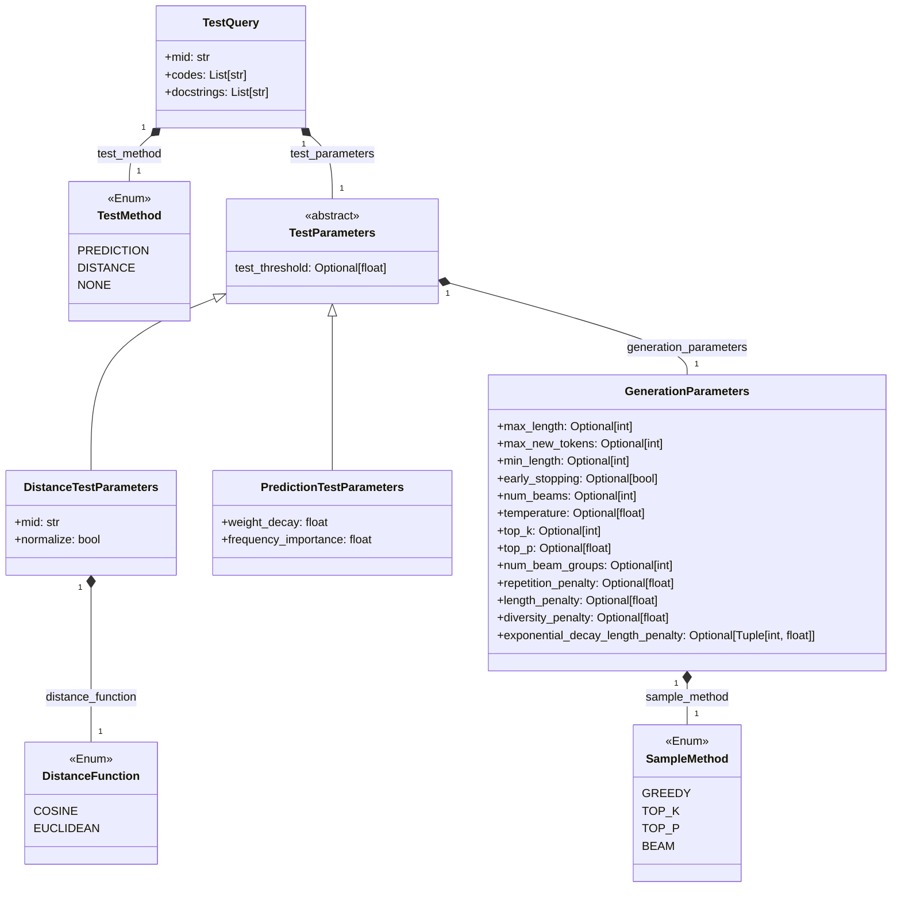
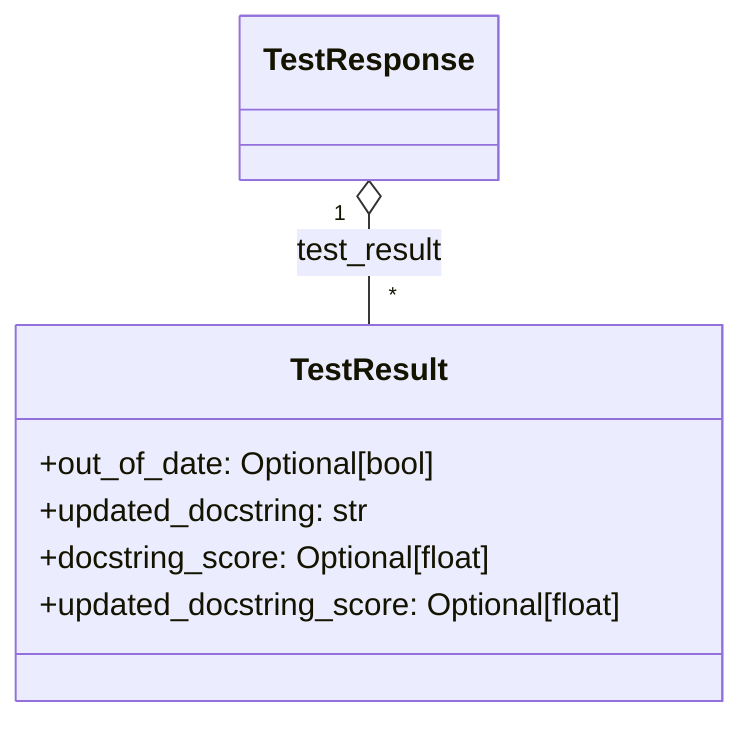

# Pydantic models for the API

## Query models

```mermaid
classDiagram

    class SampleMethod {
        <<Enum>>
        GREEDY
        TOP_K
        TOP_P
        BEAM
    }

    class TestMethod {
        <<Enum>>
        PREDICTION
        DISTANCE
        NONE
    }

    class DistanceFunction {
        <<Enum>>
        COSINE
        EUCLIDEAN
    }

    class GenerationParameters {
        +max_length: Optional[int]
        +max_new_tokens: Optional[int]
        +min_length: Optional[int]

        +early_stopping: Optional[bool]
        +num_beams: Optional[int]
        +temperature: Optional[float]
        +top_k: Optional[int]
        +top_p: Optional[float]
        +num_beam_groups: Optional[int]

        +repetition_penalty: Optional[float]
        +length_penalty: Optional[float]
        +diversity_penalty: Optional[float]
        +exponential_decay_length_penalty: Optional[Tuple[int, float]]
    }

    class TestParameters {
        <<abstract>>
        test_threshold: Optional[float]
    }

    class PredictionTestParameters {
        +weight_decay: float
        +frequency_importance: float
    }

    class DistanceTestParameters {
        +mid: str
        +normalize: bool
    }

    class TestQuery{
        +mid: str
        +codes: List[str]
        +docstrings: List[str]
    }

    TestParameters <|-- PredictionTestParameters
    TestParameters <|-- DistanceTestParameters

    GenerationParameters "1" *-- "1" SampleMethod : sample_method
    TestParameters "1" *-- "1" GenerationParameters : generation_parameters
    DistanceTestParameters "1" *-- "1" DistanceFunction : distance_function
    TestQuery "1" *-- "1" TestMethod : test_method
    TestQuery "1" *-- "1" TestParameters : test_parameters
```

## Response models

```mermaid
classDiagram
    class TestResult {
        +out_of_date: Optional[bool]
        +updated_docstring: str
        +docstring_score: Optional[float]
        +updated_docstring_score: Optional[float]
    }

    class TestResponse { }

    TestResponse "1" o-- "*" TestResult : test_result
```
