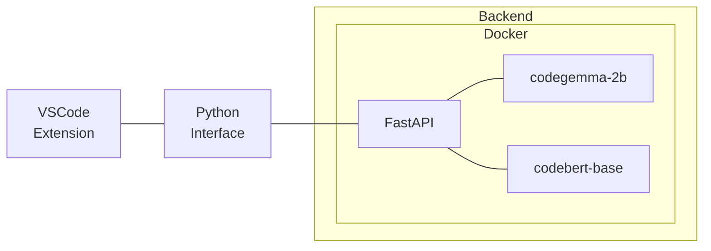

# Architecture

```mermaid
flowchart LR
    vscode[VSCode\nExtension]
    python[Python\nInterface]
    subgraph Backend
        subgraph Docker
            fastapi[FastAPI]
            codegemma[codegemma-2b]
            codebert[codebert-base]
        end
    end

    vscode --- python
    python --- fastapi
    fastapi --- codegemma
    fastapi --- codebert
```
