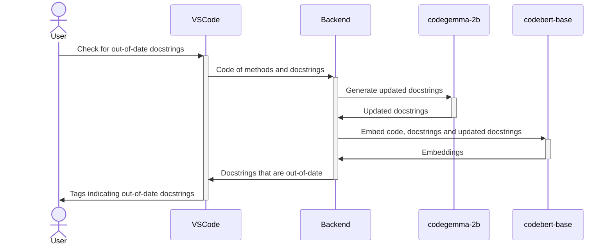
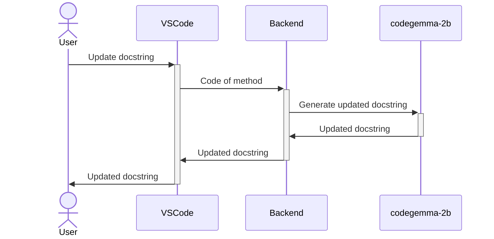

# Check for out-of-date docstrings

```mermaid
sequenceDiagram
    actor User
    participant VSCode
    participant Backend
    participant codegemma-2b
    participant codebert-base

    User->>+VSCode: Check for out-of-date docstrings
    VSCode->>+Backend: Code of methods and docstrings
    Backend->>+codegemma-2b: Generate updated docstrings
    codegemma-2b->>-Backend: Updated docstrings
    Backend->>+codebert-base: Embed code, docstrings and updated docstrings
    codebert-base->>-Backend: Embeddings
    Backend->>-VSCode: Docstrings that are out-of-date
    VSCode->>-User: Tags indicating out-of-date docstrings
```

# Update Docstrings

```mermaid
sequenceDiagram
    actor User
    participant VSCode
    participant Backend
    participant codegemma-2b

    User->>+VSCode: Update docstring
    VSCode->>+Backend: Code of method
    Backend->>+codegemma-2b: Generate updated docstring
    codegemma-2b->>-Backend: Updated docstring
    Backend->>-VSCode: Updated docstring
    VSCode->>-User: Updated docstring
```